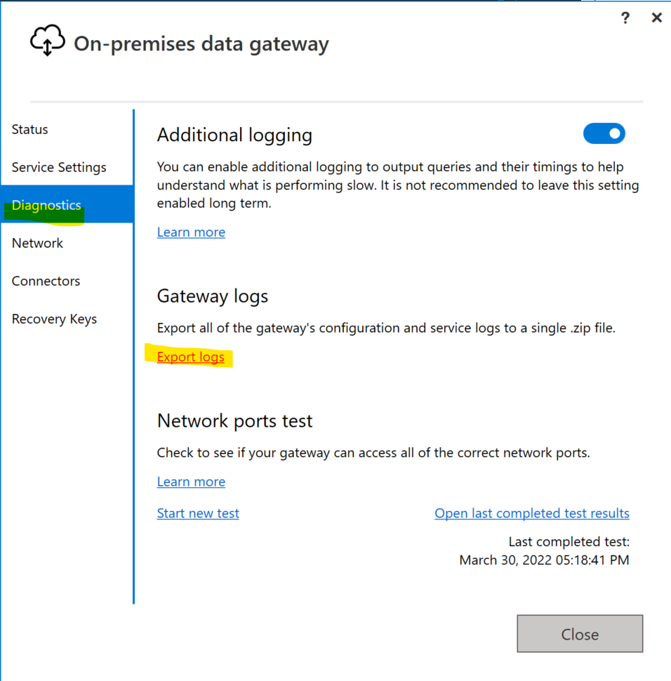
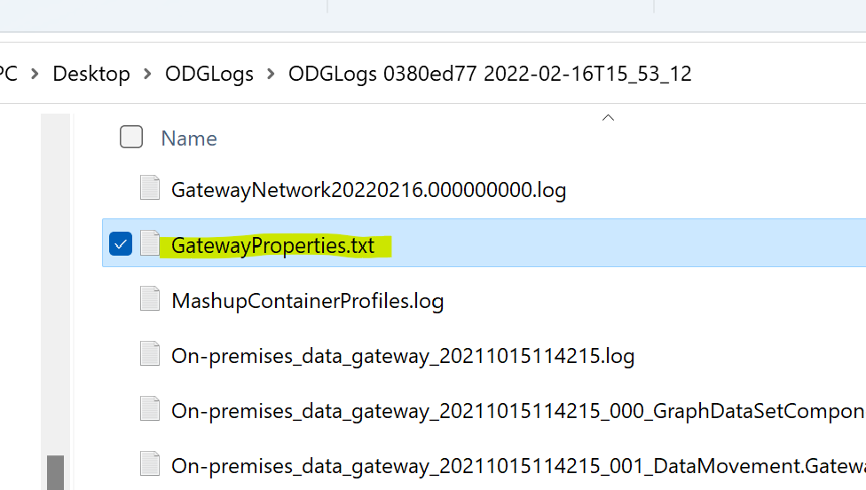
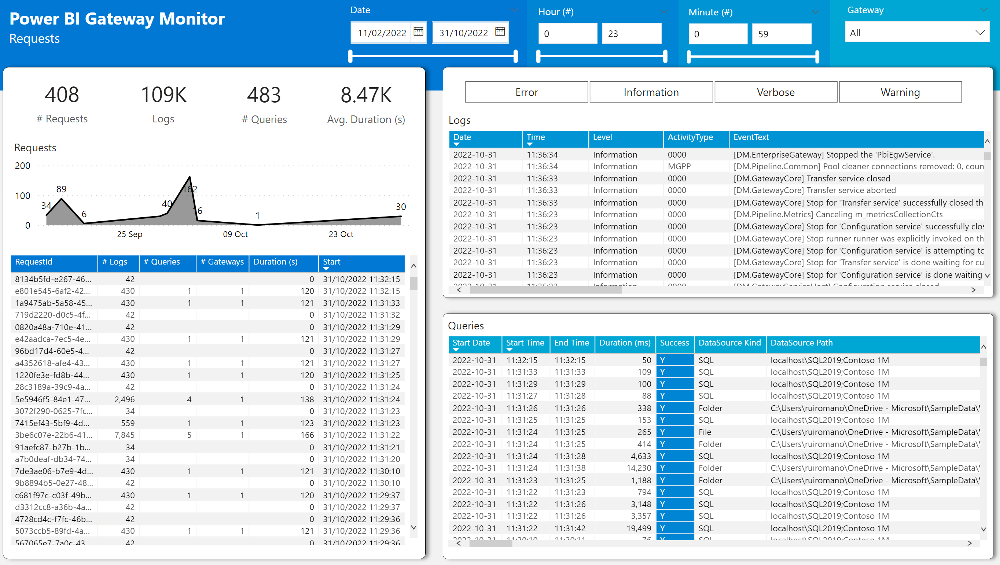

This project aim to help organizations with multiple gateway clusters centralize all their gateway logs and reports into a central storage (ADLS Gen 2) and allow easy and quick exploration of those logs either by:

- Easily access all the gateway logs without having to remote access to the gateway server
- Explore the logs with a Power BI Report
- Explore the logs using a SPARK Engine like Azure Synapse Analytics

# Setup

## Requirements

- Azure Data Lake Storage Gen2 with hierarchical namespace enabled

## Azure Data Lake Storage

Using your Azure Subscription create a new Azure Data Lake Storage resource, follow the steps of following link:

https://docs.microsoft.com/en-us/azure/storage/blobs/create-data-lake-storage-account

Dont forget to enable [Hierarchical Namespace](https://docs.microsoft.com/en-us/azure/storage/blobs/create-data-lake-storage-account#enable-the-hierarchical-namespace) when creating the storage account.

## Deploy scripts to Gateway Server

On each Gateway Server you should clone/copy this repo powershell scripts into a local folder (ex: c:\PBIGTWMonitor)

Open the "On-Premises data Gateway App", go to Diagnostics -> Export Logs:

Copy the file "GatewayProperties.txt" to the scripts folder:

## Change Config.Json

Open the [Configuration file](.\Config.json) and configure the following settings:

- StorageAccountConnStr
  
  Open the ADLS Gen 2 storage account, go to "Access Keys" tab and copy the "Connection String" field:

  

- GatewayLogsPath
  
   Confirm if the 'GatewayLogsPath' point to the correct path of the gateway logs - [more info](https://docs.microsoft.com/en-us/data-integration/gateway/service-gateway-log-files)

- OutputPath

    Temporary location of the gateway logs before copying to blob storage

- StorageAccountContainerName

    Name of the container in the storage account

- StorageAccountContainerRootPath

    Root path on the storage container to where the log files will be written to

## Schedule Task

Configure a Windows Schedule Task to run the script [Run.ps1](./Run.ps1) every hour/day

# Power BI Template

## Logs Page

## Queries Page

## Requests Page

## Mashups Profiles Page

