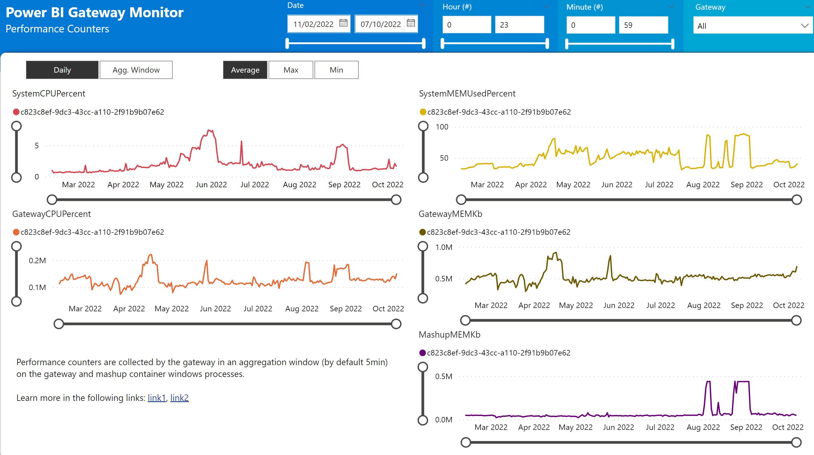
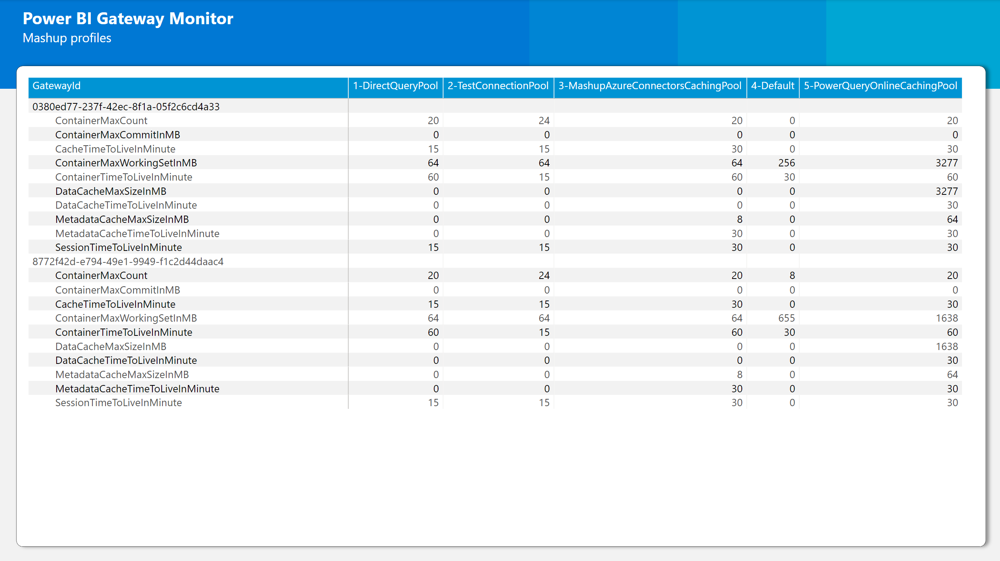

This project aim to help organizations with multiple gateway clusters centralize all their gateway logs and reports into a central storage (ADLS Gen 2) and allow easy and quick exploration of those logs either by:

- Easily access all the gateway logs without having to remote access to the gateway server
- Explore the logs with a Power BI Report
- Explore the logs using a SPARK Engine like Azure Synapse Analytics


Blog Post: https://www.linkedin.com/pulse/power-bi-gateway-monitoring-troubleshooting-solution-rui-romano/ 

# Setup

## Requirements

- Azure Data Lake Storage Gen2 with hierarchical namespace enabled
- [PowerShell 7](https://docs.microsoft.com/en-us/powershell/scripting/install/installing-powershell-on-windows?view=powershell-7.2) with the following modules installed: [Az.Accounts](https://www.powershellgallery.com/packages/Az.Accounts), [Az.Storage](https://www.powershellgallery.com/packages/Az.Storage), [MicrosoftPowerBIMgmt](https://www.powershellgallery.com/packages/MicrosoftPowerBIMgmt)

## Required PowerShell Modules

On the gateway server you must ensure [PowerShell 7](https://docs.microsoft.com/en-us/powershell/scripting/install/installing-powershell-on-windows?view=powershell-7.2) and ensure the installation of all the required modules: 
- [Az.Accounts](https://www.powershellgallery.com/packages/Az.Accounts)
- [Az.Storage](https://www.powershellgallery.com/packages/Az.Storage)
- [MicrosoftPowerBIMgmt](https://www.powershellgallery.com/packages/MicrosoftPowerBIMgmt)

Open a PowerShell 7 window prompt and run the following install commands:

```powershell
Install-Module Az.Accounts -MinimumVersion "2.8.0" -verbose

Install-Module Az.Storage -MinimumVersion "4.6.0" -verbose

Install-Module MicrosoftPowerBIMgmt -MinimumVersion "1.2.1077" -verbose
```

## Azure Data Lake Storage

Using your Azure Subscription create a new Azure Data Lake Storage resource, follow the steps of following link:

https://docs.microsoft.com/en-us/azure/storage/blobs/create-data-lake-storage-account

Dont forget to enable [Hierarchical Namespace](https://docs.microsoft.com/en-us/azure/storage/blobs/create-data-lake-storage-account#enable-the-hierarchical-namespace) when creating the storage account.

## Deploy scripts to Gateway Server

On each Gateway Server you should clone/copy this repo powershell scripts into a local folder (ex: c:\PBIGTWMonitor)

## Change Config.Json

Open the [Configuration file](.\Config.json) and configure the following settings:

- StorageAccountConnStr
  
  Open the ADLS Gen 2 storage account, go to "Access Keys" tab and copy the "Connection String" field:

  

- GatewayLogsPath
  
  Location of the Gateway logs & reports files.

  Confirm if the 'GatewayLogsPath' point to the correct path of the gateway logs - [more info](https://docs.microsoft.com/en-us/data-integration/gateway/service-gateway-log-files)

  The GatewayId is discovered automatically by looking into the first lines of the gateway report file 'SystemCounterAggregationReport*.log' but you can override this by specifying the GatewayId & GatewayName on the configuration file:

  

- OutputPath

    Temporary location of the gateway logs before copying to blob storage

- StorageAccountContainerName

    Name of the container in the storage account

- StorageAccountContainerRootPath

    Root path on the storage container to where the log files will be written to

## Schedule Task

Configure a Windows Schedule Task to run the script [Run.ps1](./Run.ps1) every hour/day


# Power BI Template

## Template Parameters

After opening the Power BI Template file (.pbit) the following parameter window will popup:


| Parameter      | Description
| ----------- | -------- 
| DataLocation      | URL Path to the root folder on the Storage Account, ex: https://storage.dfs.core.windows.net/pbigatewaymonitor/raw
| NumberDays | Filter to the log files to be fetched, if '10' Power BI will read only the latest 10 days of logs
| MaxLogTextLength | Max size of text column of logs. Default: 1000
| LogFilters | Comma separated file names of log files to be fetched. Default: "gatewayerrors,gatewayinfo" If 'None' log files will be excluded 
| GatewayFilters | Comma separated gateway id's. Default: All Gateways

## Logs Page


## Queries Page


## Counters Page



## Requests Page


## Mashups Profiles Page



## Theme
Theme Background Images here: https://alluringbi.com/gallery/