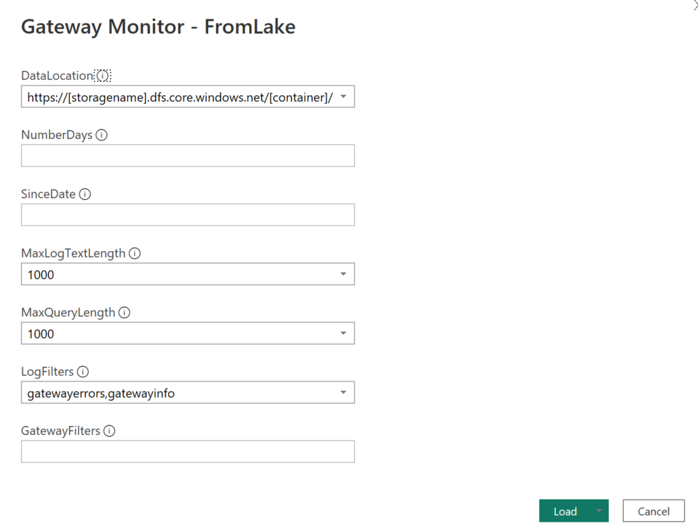
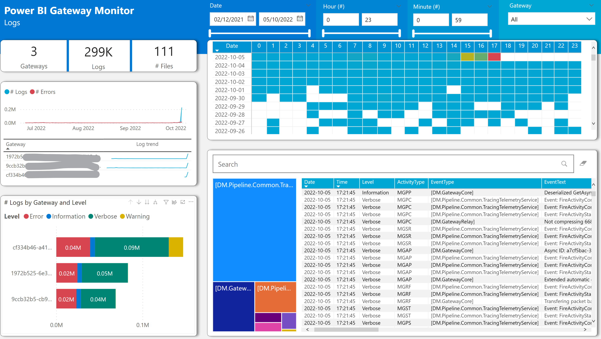
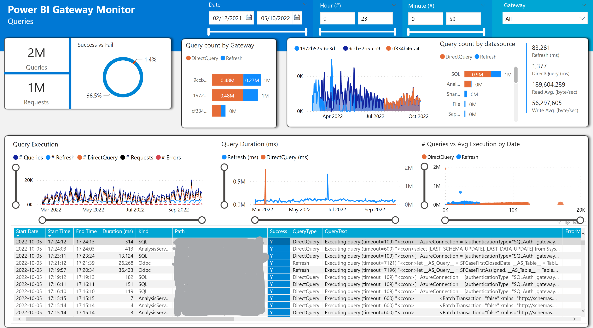
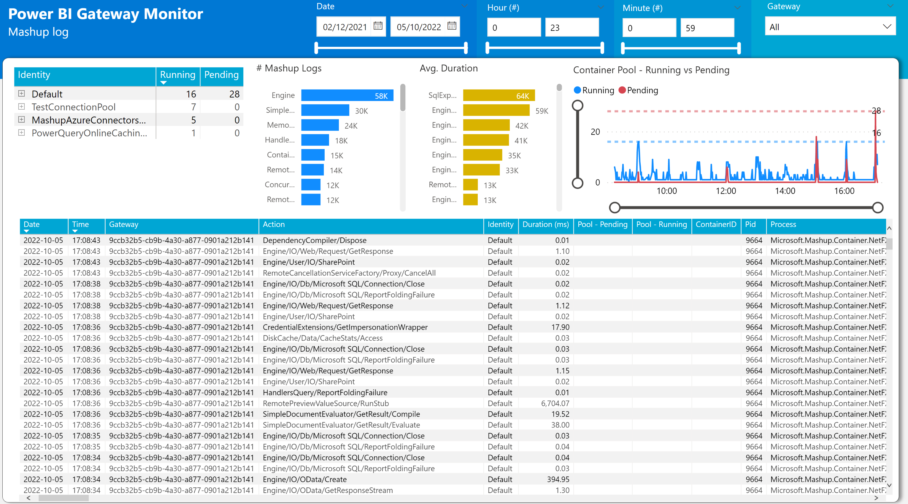

This project aim to help organizations with multiple gateway clusters centralize all their gateway logs and reports into a central storage (ADLS Gen 2) and allow easy and quick exploration of those logs either by:

- Easily access all the gateway logs without having to remote access to the gateway server
- Explore the logs with a Power BI Report
- Explore the logs using a SPARK Engine like Azure Synapse Analytics


**To quickly analyze the logs of gateways you dont need to run/deploy the powershell scripts** its possible to use the [disk Power BI template](./Gateway%20Monitor%20-%20FromDisk.pbit) and directly point to the exported gateway logs. The powershell & central storage is only required if you want to keep an fully automated gateway monitoring solution with history log data retention.

Blog Post: https://www.linkedin.com/pulse/power-bi-gateway-monitoring-troubleshooting-solution-rui-romano/ 

# Setup

## Requirements

- [Azure Data Lake Storage Account (ADLS Gen 2)](https://docs.microsoft.com/en-us/azure/storage/blobs/create-data-lake-storage-account) with [Hierarchical Namespace](https://docs.microsoft.com/en-us/azure/storage/blobs/create-data-lake-storage-account#enable-the-hierarchical-namespace) enabled
- [PowerShell 7](https://docs.microsoft.com/en-us/powershell/scripting/install/installing-powershell-on-windows?view=powershell-7.2) on the Gateway Server, with the following modules installed: [Az.Accounts](https://www.powershellgallery.com/packages/Az.Accounts), [Az.Storage](https://www.powershellgallery.com/packages/Az.Storage)

### Azure Data Lake Storage Account (ADLS Gen 2)

Using your Azure Subscription create a new Azure Data Lake Storage resource, follow the steps of following link:

https://docs.microsoft.com/en-us/azure/storage/blobs/create-data-lake-storage-account

Enable the [Hierarchical Namespace](https://docs.microsoft.com/en-us/azure/storage/blobs/create-data-lake-storage-account#enable-the-hierarchical-namespace) when creating the storage account.


### PowerShell Modules

On the gateway server ensure [PowerShell 7](https://docs.microsoft.com/en-us/powershell/scripting/install/installing-powershell-on-windows?view=powershell-7.2) is installed and install the following required modules: 
- [Az.Accounts](https://www.powershellgallery.com/packages/Az.Accounts)
- [Az.Storage](https://www.powershellgallery.com/packages/Az.Storage)

To install the modules above, open a PowerShell 7 prompt and run the following commands:

```powershell
Install-Module Az.Accounts -MinimumVersion "2.8.0" -verbose

Install-Module Az.Storage -MinimumVersion "4.6.0" -verbose

Install-Module MicrosoftPowerBIMgmt -MinimumVersion "1.2.1077" -verbose
```

## Deploy scripts to Gateway Server

On each Gateway Server you should clone/copy this repo powershell scripts into a local folder (ex: c:\PBIGTWMonitor)

### Change Config.Json

 

Open the [Configuration file](./Config.json) and configure the following settings:

- StorageAccountConnStr
  
  Open the ADLS Gen 2 storage account, go to "Access Keys" tab and copy the "Connection String" field:

  

- GatewayLogsPath
  
  Location of the Gateway logs & reports files.

  Confirm if the 'GatewayLogsPath' point to the correct path of the gateway logs - [more info](https://docs.microsoft.com/en-us/data-integration/gateway/service-gateway-log-files)

  The script automatically discovers the GatewayId and Number of Cores of the gateway and stores this information on the /metadata/gatewayproperties.json file, but its possible to override these values on the 'GatewayLogsPath' property of the configuration file:

  

- OutputPath

    Temporary location of the gateway logs before copying to blob storage

- StorageAccountContainerName

    Name of the container in the storage account

- StorageAccountContainerRootPath

    Root path on the storage container to where the log files will be written to

### Schedule Task

Configure a Windows Schedule Task to run the script [Run.ps1](./Run.ps1) every hour/day


# Power BI Template

There are two Power BI templates available:

- [Lake Template](./Gateway%20Monitor%20-%20FromLake.pbit) - When gateway log data resides in the ADLS Gen 2 lake
- [Disk Template](./Gateway%20Monitor%20-%20FromDisk.pbit) - When gateway log data reside in disk, useful to analyze the logs directly from the gateway server or [gateway log export](https://learn.microsoft.com/en-us/data-integration/gateway/service-gateway-tshoot#collect-logs-from-the-on-premises-data-gateway-app). You dont need to deploy the powershell scripts to use this template, only need to have access to gateway logs.


## Template Parameters

After opening the Power BI Template file (.pbit) the following parameter window will popup:




| Parameter      | Description
| ----------- | -------- 
| DataLocation      | URL Path to the root folder including the container name (default: '/pbigatewaymonitor/RAW'), using the Distributed File System (DFS) endpoint of the storage account, ex: https<span>://storage.<strong>dfs</strong>.core.windows.net/<strong>pbigatewaymonitor/raw</strong>; Or the path to the disk location with logs if the disk template is used
| NumberDays | Filter to the log files to be fetched, if '10' Power BI will read only the latest 10 days of logs/queries/counters Default: null (all days)
| SinceDate | Only read log/query files since the specified date. This parameter overrides 'NumberDays' Default: null (all days)
| MaxLogTextLength | Max size of text column of logs. Default: 1000
| LogFilters | Comma separated file names of log files to be fetched. Default: "gatewayerrors,gatewayinfo" If 'None' log files will be excluded 
| GatewayFilters | Comma separated gateway id's. Default: All Gateways

## Logs Page



## Queries Page



## Gateway Profile


## Counters Page


## Requests Page


## Mashups Profiles Page


## Mashups Logs Page



## Theme
Theme Background Images here: https://alluringbi.com/gallery/